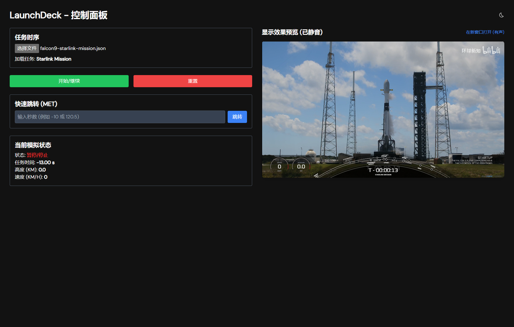

# LaunchDeck - 高度可定制的火箭发射模拟器

[](https://nuxt.com)
[](https://vuejs.org)
[](https://www.typescriptlang.org/)
[](https://github.com/unocss/unocss)
[](https://opensource.org/licenses/MIT)

一个基于 Nuxt 3 和 Vue 3 构建的现代化、高性能的火箭发射任务模拟与可视化平台。其核心特点是**数据驱动**：整个发射流程，包括遥测数据、关键事件和显示信息，都由一个独立的 `JSON` 文件定义，实现了逻辑与UI的完全分离。

本项目深度整合了 SpaceX 风格的发射仪表盘UI，提供了包括动态仪表、SVG时间轴和流畅动画在内的高保真视觉体验。

---

### ✨ 效果预览

<!-- 强烈建议在此处替换为项目的动态 GIF 或视频截图 -->
<p align="center">
  
  <br/>
  <em>https://launch-deck-video.netlify.app/</em>
</p>

---

### 核心功能

- 🚀 **完全数据驱动**: 整个模拟过程由一个 `JSON` 文件驱动。您可以通过修改 `JSON` 来定义全新的发射任务，无需改动任何前端代码。
- 🛰️ **高保真UI**: 默认搭载 SpaceX 风格的仪表盘，包含：
  - 实时更新的速度和高度仪表盘 (`Gauge`)。
  - 动态 SVG 发射时间轴 (`TimelineSvg`)，能够流畅展示任务节点。
  - 带有入场/出场动画的临时信息提示卡。
- ⏱️ **高精度计时**: 采用基于 `performance.now()` 的计时引擎，确保模拟时钟的精准和动画的流畅。
- 📊 **实时插值遥测**: 通过在关键遥测节点之间进行**平滑线性插值**，即使数据点稀疏，也能创造出连续、流畅的高度和速度变化动画。
- 📺 **视频同步**: 支持将模拟过程与本地视频文件精确同步，包括播放、暂停、跳转和重置。
- ⚙️ **解耦架构**:
  - **控制面板 (`/`)**: 用于加载任务文件、控制模拟进程（开始/暂停/重置/跳转）。
  - **显示面板 (`/control`)**: 专用于展示，可全屏显示。
  - 两者通过 `BroadcastChannel` API 通信，实现了窗口/标签页之间的完全解耦。
- 🔇 **iframe 实时预览**: 控制面板内嵌了一个**静音**的 `iframe` 预览窗口，提供100%真实的“所见即所得”效果。

---

### 🛠️ 技术栈

- **核心框架**: [Nuxt 3](https://nuxt.com) (v3.17.4) + [Vue 3](https://vuejs.org)
- **语言**: [TypeScript](https://www.typescriptlang.org/)
- **状态管理**: [Pinia](https://pinia.vuejs.org/)
- **样式方案**: [UnoCSS](https://github.com/unocss/unocss) (即时原子化CSS引擎)
- **核心API**: `BroadcastChannel` API, `performance.now()`

---

### 快速开始

#### 1. 启动应用

项目包含两个主要页面：

- **控制面板**: 访问根路径 `http://localhost:10630/`
- **显示面板**: 访问路径 `http://localhost:10630/control`

通常，您只需要打开**控制面板**。控制面板右侧的预览区已经内嵌了显示面板。您也可以点击预览区上方的“在新窗口打开”链接，来打开一个独立的、有声音的显示面板。

#### 2. 加载任务文件

在控制面板的“任务时序”卡片中，点击“选择文件”按钮，加载一个符合格式的 `JSON` 文件。

项目在 `public/` 目录下提供了两个示例文件，可以直接使用：

- `public/spacex-falcon9-mission.json` (猎鹰9号任务)
- `public/zq2e-y2.json` (朱雀二号遥二任务)

#### 3. 控制模拟

加载文件后，即可使用控制按钮：

- **开始/继续**: 启动或从暂停处继续模拟。
- **暂停**: 暂停模拟。
- **重置**: 将模拟重置到由 `videoConfig.startTimeOffset` 定义的初始状态。
- **快速跳转**: 输入以秒为单位的MET（任务经过时间，负数代表T-），然后点击跳转。

---

### 📄 任务数据文件格式

这是驱动整个模拟的核心。一个标准的 `JSON` 文件结构如下：

```json
{
  "missionName": "任务名称 (例如: Starlink Mission)",
  "vehicle": "运载工具名称 (例如: Falcon 9)",
  "videoConfig": {
    "type": "local",
    "source": "/videos/your_video.mp4",
    "startTimeOffset": -13
    // 视频的第0秒对应模拟时间的T-13秒
  },
  "events": [
    {
      "time": 0,
      "name": "LIFTOFF",
      // telemetry (可选): 定义该时间点的遥测数据快照
      // 在两个遥测节点之间，数据会被平滑插值
      "telemetry": {
        "speed_kmh": 0,
        "altitude_km": 0
      },
      // displayInfo (可选): 定义该时间点要临时显示的右下角信息
      "displayInfo": {
        "title": "LIFTOFF",
        "line1": "FALCON 9 HAS CLEARED THE TOWER",
        "line2": "",
        "line3": ""
      }
    },
    {
      "time": 72,
      "name": "MAX-Q",
      "telemetry": {
        "speed_kmh": 1900,
        "altitude_km": 11.5
      },
      "displayInfo": {
        "title": "MAX-Q",
        "line1": "MAXIMUM DYNAMIC PRESSURE",
        "line2": "THIS IS THE LARGEST AMOUNT OF STRESS",
        "line3": "EXERTED ON THE VEHICLE"
      }
    }
    // ... 更多事件节点
  ]
}
```

---

### 📦 项目设置

1.  **克隆项目**

    ```bash
    git clone https://github.com/lanseria/LaunchDeck-nuxt-app.git
    cd LaunchDeck-nuxt-app
    ```

2.  **安装依赖**
    推荐使用 `pnpm`：

    ```bash
    pnpm install
    ```

3.  **启动开发服务器**
    ```bash
    pnpm dev
    ```
    应用将在 `http://localhost:10630` 上运行。

```
docker run -d -p 10630:3000 --name launchdeck-app --restart always ghcr.io/lanseria/launchdeck-nuxt-app:sha-fbe024a
6dfdb7c2a508d3d5baa8c089223a133914f5b2293c2a280b58014ee0a54f68d1
```

---

### 目录结构概览

- `composables/store/control.ts`: **核心逻辑**，包含模拟引擎和计时器。
- `composables/store/display.ts`: **显示逻辑**，负责接收和存储广播数据。
- `components/Dashboards/SpaceXFalcon9.vue`: **主UI组件**，组装了所有仪表盘元素。
- `components/Dashboards/Common/`: 存放如 `Gauge.vue`, `TimelineSvg.vue` 等可复用的UI子组件。
- `pages/index.vue`: 控制面板页面。
- `pages/control.vue`: 显示面板页面。
- `public/`: 存放任务 `JSON` 文件和视频文件。
- `types/launchdeck.d.ts`: 全局 TypeScript 类型定义。

---

### 💡 未来可拓展方向

- **更多主题**: 创建新的仪表盘主题组件，并通过 `controlStore` 实现主题切换。
- **实时API对接**: 修改 `controlStore` 以从 WebSocket 或 SSE API 获取实时遥测数据，而不是从文件读取。
- **交互式编辑器**: 创建一个UI界面，让用户可以可视化地编辑 `events` 时间轴和其属性。

---

### 致谢

- 本项目基于 [Vitesse for Nuxt 3](https://github.com/antfu/vitesse-nuxt3) 模板。
- UI风格和部分组件逻辑的灵感来源于 [spacex-launch-timeline](https://github.com/HarishChaudhari/spacex-launch-timeline) 项目。

---

### 许可证

[MIT](./LICENSE) © 2024 Lanseria
